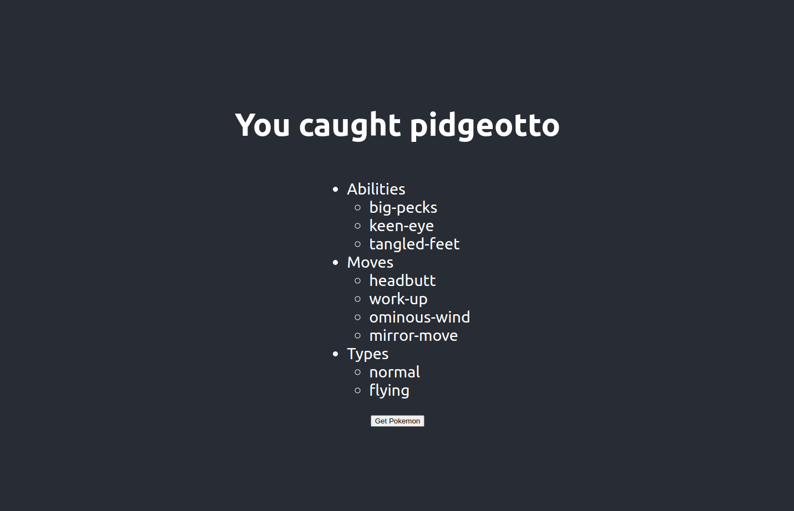

### Main page. Click on Get Pokemon


### Result Page that fetches pokemon and shows details


```javascript

//shuffles array randomly by
const shuffled = type.sort(() => 0.5 - Math.random());
//get first 4 elements

let selected = shuffled.slice(0, 4);

```